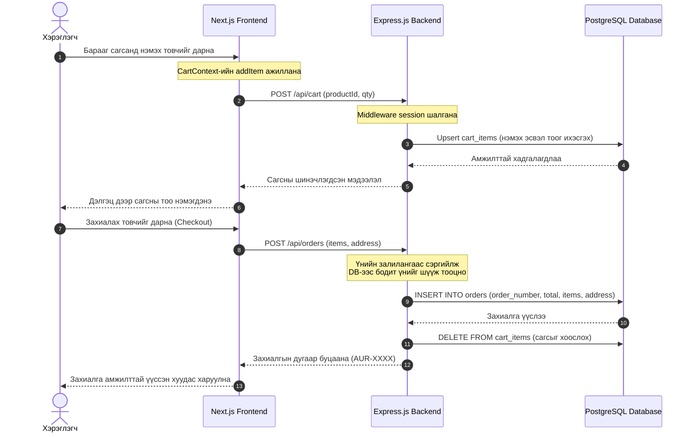

# 🌸 AURA SKIN — Арьс Арчилгааны Цахим Худалдааны Систем

Энэхүү төсөл нь **AURA SKIN** арьс арчилгааны бүтээгдэхүүний цахим худалдааны (E-commerce) систем юм. Frontend болон Backend салсан бүтэцтэй, өгөгдлийн сангийн оновчтой шийдэл болон аюулгүй байдлын хамгаалалтуудыг багтаасан.

---

## 🚀 Ажиллуулах заавар (Getting Started)

### 1. Backend-ийг ажиллуулах

```bash
cd server
npm install
# .env файлыг тохируулах (локал эсвэл Neon DB холболт)
npm run dev
```

### 2. Frontend-ийг ажиллуулах

```bash
# Төслийн үндсэн хавтсанд
npm install
npm run dev
```

Хөтөч дээр [http://localhost:3000](http://localhost:3000) хаягаар нээж үзнэ үү.

---

## 🏗️ Ерөнхий архитектур (Overall Architecture)

- **Frontend**: Next.js 16 (App Router), React 19, Tailwind CSS v4, shadcn/ui.
- **Backend**: Express.js REST API.
- **Database**: PostgreSQL (Локал болон Neon Cloud DB-ийг автоматаар таньдаг).
- **Authentication**: Сесс дээр суурилсан (`express-session` + `connect-pg-simple` ашиглан session PostgreSQL-д хадгалдаг).

---

## 📁 Хавтасны бүтэц ба Файлуудын ажиллагаа (File-by-File)

### 1. 🖥️ Backend (`server/`)

Backend нь Express сервер болон өгөгдлийн сантай ажиллах логикийг агуулна.

- 📝 **`server/src/index.js`** — Серверийн үндсэн файл. `helmet` (HTTP хамгаалалт), `cors` (күүки дамжуулах тохиргоотой), сесс хадгалах `PgSession`, хурд хязгаарлагч `apiLimiter` зэргийг холбож, бүх API замуудыг (`/api/*`) эхлүүлнэ.
- 📝 **`server/src/config/db.js`** — PostgreSQL өгөгдлийн сантай холбогдох холболтын сан (Pool). Neon Cloud болон локал Homebrew-ийг автоматаар таньж, SSL холболтыг шийднэ.
- 📁 **`server/migrations/`** — Өгөгдлийн сангийн бүтэц.
  - `001_schema.sql`: Хэрэглэгч, бүтээгдэхүүн, сагс, захиалга, сэтгэгдлийн хүснэгтүүд болон сэтгэгдэл бичихэд барааны үнэлгээг автоматаар бодож шинэчилдэг Database trigger-үүдийг агуулсан.
  - `002_additions.sql`: Сүүлд нэмэгдсэн хүргэлтийн үнэ, орц найрлага зэрэг талбаруудын шилжилт.
- 📁 **`server/src/middleware/`** — Хамгаалалтын шүүлтүүрүүд (Дэлгэрэнгүйг доорх хэсгээс үзнэ үү).
- 📁 **`server/src/routes/`** — API замуудын логик:
  - `auth.js`: Бүртгэл, нэвтрэлт, гарах үйлдэл. Нууц үгийг санамсаргүй 32-байтын `salt` үүсгэж, `bcryptjs` ашиглан Salted Hashing хэлбэрээр хадгалдаг.
  - `products.js`: Барааны CRUD үйлдлүүд, шүүлтүүр, хайлт болон зураг хуулах (Multer) ажиллагаа.
  - `cart.js`: Хэрэглэгчийн сагсыг өгөгдлийн сан руу синк хийх (Upsert логик).
  - `orders.js`: Захиалга үүсгэх логик. Үнийн залилангаас сэргийлж, нийт дүнг DB-ийн бодит үнээр дахин тооцоолж хамгаалдаг.
  - `reviews.js`: Бараанд сэтгэгдэл, үнэлгээ бичих, устгах.
  - `users.js`: Хэрэглэгчийн профайл, нууц үг солих, аватар зураг хуулах логик.

---

### 2. 🎨 Frontend (`src/`)

Next.js App Router бүтэц дээр суурилсан хэрэглэгчийн харагдац.

- 📝 **`src/app/layout.js`** — Вэбсайтын суурь бүтэц. Глобал фонт, гэрэлт/харанхуй горим (`ThemeProvider`), сесс болон сагсны холбоосууд (`Provider`-ууд) болон глобал хайлтын цонхыг агуулна.
- 📝 **`src/app/page.js`** — Нүүр хуудас. Server Component тул HTML-ийг сервер талд бэлдэж илгээнэ (SEO-д маш сайн).
- 📁 **`src/context/`** — Глобал төлөвүүд (State Management).
  - `SessionContext.jsx`: Хэрэглэгчийн нэвтрэлтийн төлөвийг серверээс (`/api/auth/me`) уншиж удирдах.
  - `CartContext.jsx`: Сагсны төлөвийг хөтөлж, өгөгдлийг сервер тал руу синк хийх.
- 📁 **`src/app/products/`** — Барааны хуудаснууд.
  - `page.js`: Бараа шүүх, эрэмбэлэх, хайх хуудас.
  - `[slug]/page.js`: Тухайн нэг барааны дэлгэрэнгүй мэдээлэл, заавар, орц найрлага болон сэтгэгдэл харуулах хэсэг.
- 📁 **`src/app/cart/` & `checkout/`** — Хэрэглэгчийн сагс болон хүргэлтийн хаяг оруулан захиалга өгөх хуудаснууд.
- 📁 **`src/app/admin/`** — Хянах самбар (Dashboard). Орлого, сэтгэгдэл, захиалгын тоог графикаар харуулж, бараа, хэрэглэгчийг удирдах хэсэг.
- 📁 **`src/components/`** — Дахин ашиглагдах UI хэсгүүд.
  - `Navbar.jsx`: Дээд цэс (ангилал, хайлт, сагсны тоолуур, профайл цэс).
  - `ProductCard.jsx`: Барааны карт.
  - `SearchPalette.jsx`: `/` товчоор нээгдэх глобал ухаалаг хайлтын систем.

---

## 🛡️ Middleware гэж юу вэ? Системд хэрхэн хэрэглэгдсэн бэ?

**Middleware (Дундын программ хангамж)** нь хэрэглэгчээс ирсэн хүсэлт (Request) серверт бүрэн боловсруулагдахаас өмнө **дундуур нь орж ажилладаг туслах функцүүд** юм.

Хүсэлтийг эцсийн цэг рүү шилжүүлэхдээ `next()` функцийг дууддаг. Хэрэв шаардлага хангахгүй бол (жишээ нь нэвтрээгүй байвал) хүсэлтийг дундаас нь шууд зогсоож алдааны хариу буцаана.

### Төсөлд ашиглагдаж буй Middleware-үүд:

1. **`requireAuth`** (`server/src/middleware/auth.js`):
   - _Үүрэг:_ Хэрэглэгч нэвтэрсэн эсэхийг шалгана. Нэвтрээгүй байвал 401 алдаа буцаана.
2. **`requireAdmin`** (`server/src/middleware/auth.js`):
   - _Үүрэг:_ Хэрэглэгчийн эрх `admin` мөн эсэхийг шалгана. Биш бол 403 (Forbidden) алдаа буцаана.
3. **`requireOwnerOrAdmin`** (`server/src/middleware/auth.js`):
   - _Үүрэг:_ Зөвхөн өөрийн профайл эсвэл өөрийн захиалга руу хандаж буй эсэхийг шалгана (Admin-д бүгд нээлттэй).
4. **`loginLimiter`** (`server/src/middleware/rateLimiter.js`):
   - _Үүрэг:_ Brute-force халдлагаас сэргийлж нэг имэйл/IP-ээс 15 минутанд хамгийн ихдээ 5 удаа амжилтгүй нэвтрэх оролдлого хийхийг зөвшөөрнө.
5. **`apiLimiter`** (`server/src/middleware/rateLimiter.js`):
   - _Үүрэг:_ DDoS халдлагаас сэргийлж 1 минутанд 100-аас дээш хүсэлт явуулахыг хязгаарлана.

---

## 🔄 Захиалга хийх урсгал (Data Flow)



---

## 📌 Заавал мэдэх архитектур болон аюулгүй байдлын шийдлүүд (Must-Know Architecture & Security Solutions)

Энэхүү системд дараах чухал аюулгүй байдал, автоматжуулалтын шийдлүүдийг нэвтрүүлсэн бөгөөд хөгжүүлэлтийн явцад эдгээрийг заавал анхаарах шаардлагатай:

### 1. Үнийн залилангаас сэргийлэх хамгаалалт (Price Manipulation Protection)
* **Асуудал:** Хэрэглэгч вэб хөтөч дээрээ барааны үнийг өөрчлөн хямд үнээр сервер рүү захиалгын хүсэлт илгээх эрсдэлтэй.
* **Шийдэл:** `orders.js` дээр захиалга үүсгэхэд Frontend-ээс ирсэн үнийн мэдээлэлд шууд итгэдэггүй. Сервер тал хүлээн авсан `productId`-аар PostgreSQL өгөгдлийн сангаас бодит үнийг шүүж, нийт дүнг шинээр бодож хамгаална.

### 2. Нууц үгийн найдвартай хадгалалт (Salted Password Hashing)
* **Асуудал:** Энгийн хэш хийсэн (жишээ нь зөвхөн MD5 эсвэл энгийн SHA) нууц үгнүүд нь Rainbow Table халдлагаар амархан тайлагдах боломжтой.
* **Шийдэл:** Хэрэглэгчийг бүртгүүлэхэд хэрэглэгч бүрт зориулсан санамсаргүй 32-байтын давс (`salt`) үүсгэж, нууц үгтэй нэгтгэн `bcryptjs` ашиглан хэш хийнэ. `password_hash` болон `salt` хоёрыг өгөгдлийн санд тусдаа талбарт хадгалж аюулгүй байдлыг хангана.

### 3. Сессийн хамгаалалт (Session Fixation & Cookie Security)
* **Асуудал:** Хэрэглэгч нэвтрэхээс өмнөх сессийн ID-ийг халдагч олж авч, нэвтэрсний дараа нь тухайн сессээр дамжин хэрэглэгчийн аккаунт руу хандах эрсдэл (Session Fixation).
* **Шийдэл:** Хэрэглэгч нэвтрэх (`login`) болон бүртгүүлэх (`register`) бүрт өмнөх сессийг бүрэн устгаж, шинээр үүсгэдэг (`req.session.regenerate`). Мөн сесс хадгалах күүкиг `httpOnly: true` (JS-ээр унших боломжгүй), `sameSite: 'lax'` (CSRF-ээс хамгаалах) болон Production орчинд зөвхөн HTTPS-ээр дамждаг `secure: true` тохиргоотой болгосон.

### 4. Өгөгдлийн сангийн автомат триггерүүд (Database Triggers)
* **Шийдэл:**
  * `fn_update_timestamp`: Бүх хүснэгтийн мөр шинэчлэгдэх бүрт `updated_at` баганын утгыг одоогийн цагаар автоматаар шинэчилнэ.
  * `fn_update_product_rating`: Сэтгэгдлийн (`reviews`) хүснэгтэд шинээр сэтгэгдэл нэмэгдэх, өөрчлөгдөх, эсвэл устгагдах үед тухайн барааны дундаж одны үнэлгээ (`rating`) болон нийт сэтгэгдлийн тоог (`reviews_count`) өгөгдлийн сан өөрөө автоматаар тооцоолж `products` хүснэгтэд хадгална. Ингэснээр API талд нэмэлт query бичих шаардлагагүй.

### 5. Холболтыг автоматаар таних шийдэл (Cloud vs Local Auto-detection)
* **Шийдэл:** `db.js` нь `DATABASE_URL` дотор `neon.tech` эсвэл `sslmode=require` байгаа эсэхийг шалгана.
  * Cloud (Neon PostgreSQL) байвал SSL холболтыг автоматаар идэвхжүүлж (`ssl: { rejectUnauthorized: false }`), холболтын санг 5 хүртэл хязгаарлана (Neon-ий үнэгүй хувилбарын холболтын хязгаарлалтад тааруулан).
  * Локал өгөгдлийн сан байвал SSL-гүйгээр хурдан ажиллахын тулд холболтын дээд хязгаарыг 20 болгож нэмэгдүүлнэ.

